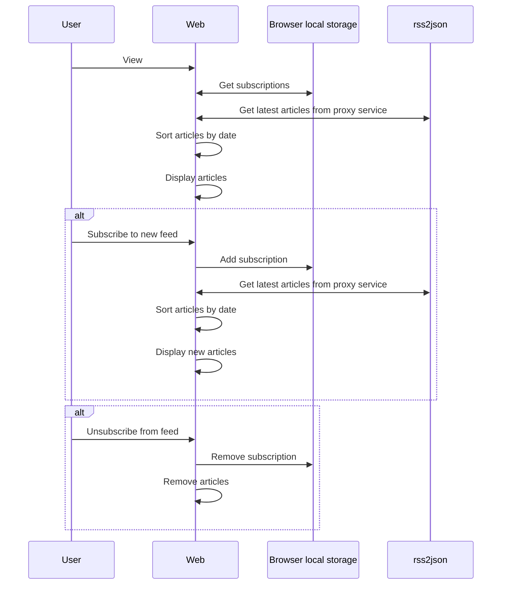

<h1>
<svg xmlns="http://www.w3.org/2000/svg" width="16" height="16" fill="currentColor" class="bi bi-rss" viewBox="0 0 16 16">
  <path d="M14 1a1 1 0 0 1 1 1v12a1 1 0 0 1-1 1H2a1 1 0 0 1-1-1V2a1 1 0 0 1 1-1zM2 0a2 2 0 0 0-2 2v12a2 2 0 0 0 2 2h12a2 2 0 0 0 2-2V2a2 2 0 0 0-2-2z"/>
  <path d="M5.5 12a1.5 1.5 0 1 1-3 0 1.5 1.5 0 0 1 3 0m-3-8.5a1 1 0 0 1 1-1c5.523 0 10 4.477 10 10a1 1 0 1 1-2 0 8 8 0 0 0-8-8 1 1 0 0 1-1-1m0 4a1 1 0 0 1 1-1 6 6 0 0 1 6 6 1 1 0 1 1-2 0 4 4 0 0 0-4-4 1 1 0 0 1-1-1"/>
</svg> RSS
</h1>

Create a curated list of the latest articles from your favorite blogs.

## Workflow
