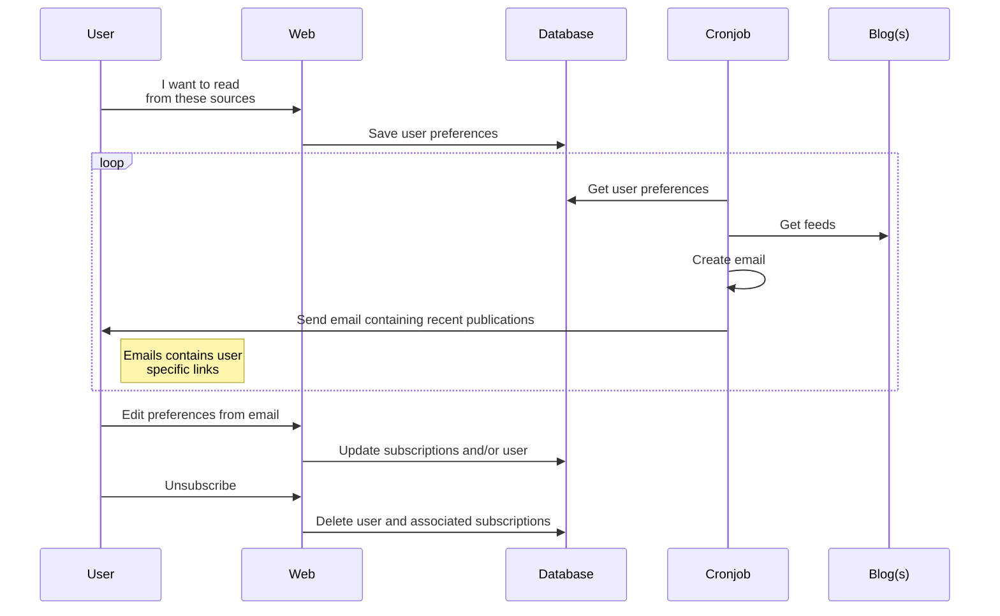

## Workflow

```mermaid
sequenceDiagram
    User->>Web: I want to read <br> from these sources
    Web->>Database: Save user preferences
    loop
        Cronjob->>Database: Get user preferences
        Cronjob->>Blog(s): Get feeds
        Cronjob->>Cronjob: Create email
        Cronjob->>User: Send email containing recent publications
        Note right of User: Emails contains user <br>specific links
    end
    User->>Web: Edit preferences from email
    Web->>Database: Update subscriptions and/or user
    User->>Web: Unsubscribe
    Web->>Database: Delete user and associated subscriptions
```

## Deploy
[deploy.md](./deploy.md)