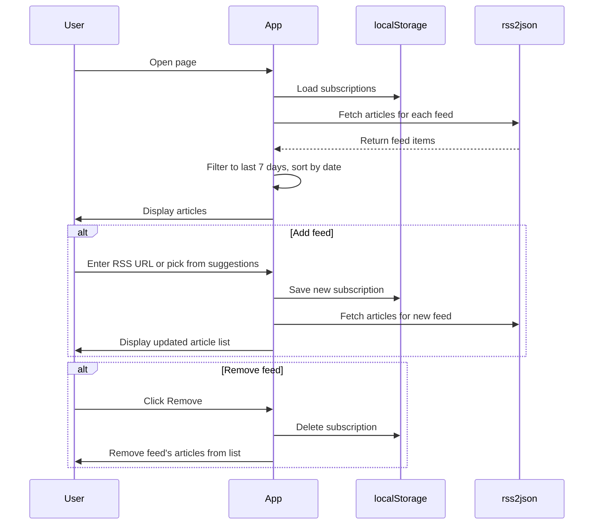

# RSS Reader

A minimal, client-side RSS reader. Subscribe to blogs, see their latest articles in one place.

No build tools. No dependencies. Vanilla HTML, CSS, and JavaScript.

## Features

- Articles from the last 7 days, sorted by date
- Subscriptions stored in browser `localStorage`
- Curated list of suggested feeds to discover
- Add any RSS/Atom feed by URL

## How it works

```mermaid
sequenceDiagram
    User->>App: Open page
    App->>localStorage: Load subscriptions
    App->>rss2json: Fetch articles for each feed
    rss2json-->>App: Return feed items
    App->>App: Filter to last 7 days, sort by date
    App->>User: Display articles

    alt Add feed
        User->>App: Enter RSS URL or pick from suggestions
        App->>localStorage: Save new subscription
        App->>rss2json: Fetch articles for new feed
        App->>User: Display updated article list
    end

    alt Remove feed
        User->>App: Click Remove
        App->>localStorage: Delete subscription
        App->>User: Remove feed's articles from list
    end
```
